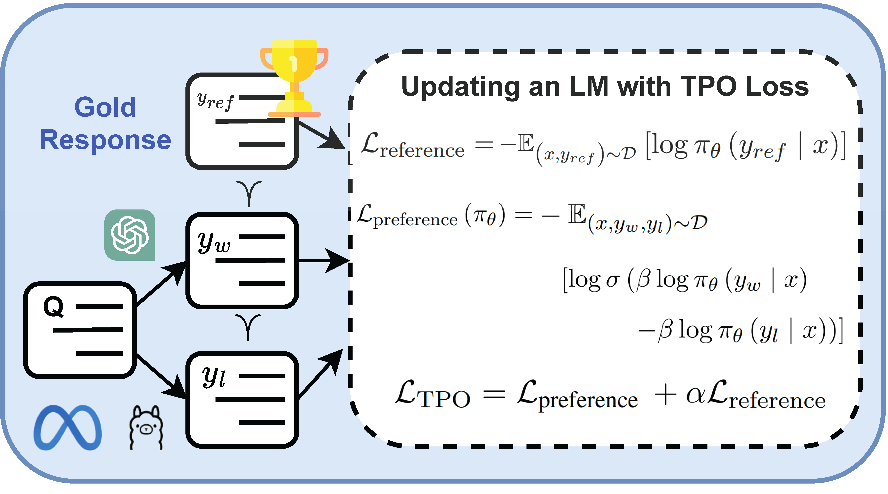

<p align="center">
    
</p>

<div align="center">
    
# TPO: Triple Preference Optimization
</div>

<p align="center">
<a href="LICENSE" alt="MIT License"></a>

<!-- <a href="https://cogintlab-asu.github.io/" alt="asu">ASU</a> -->
<!-- <a href="https://www.microsoft.com/en-us/research/" alt="MSlogo"></a>
<a href="https://twitter.com/fe1ixxu">
  </a>
</p> -->


 Triple Preferences Optimization (TPO) is a new preference learning method designed to align an LLM with three preferences without requiring a separate supervised fine-tuning step. The simple one-step combination of SFT and Preference Optimization outperforms current state-of-the-art alignment methods such as DPO, CPO, KTO and IPO.

## Environment and TPO Setup 🔧
This is a quick tutorial to set up and train a model with the TPO method.
1. Create a conda environment:
```
conda create --prefix tpo python=3.9 
conda activate tpo
```
2. If you are using **Nvidia GPUs** install torch 1.13.1 with cuda 11.7
```
pip install torch==1.13.1+cu117 torchvision==0.14.1+cu117 torchaudio==0.13.1 --extra-index-url https://download.pytorch.org/whl/cu117
```
3. Install the requirements:
```
pip install -r requirements.txt
```
4. Prepare a suitable dataset. In `./utils/dataset.py`, there is a parameter called `n.` You can change the size of the dataset by changing this parameter.
(We attached a sample dataset in the `data` folder we used for training. However, you can change the size.)
```
python dataset.py
```
5. Run the run_tpo.sh to train a model with TPO. This study used `alignment-handbook/zephyr-7b-sft-full` and `mistralai/Mistral-7B-v0.1` models. However, you can use other models to train with TPO.
```
#!/bin/bash

OUTPUT_DIR="/OUTPUT/DIR/PATH"

accelerate launch \
 --config_file configs/deepspeed_train_config_bf16.yaml \
  run_tpo.py  \
    --model_name_or_path mistralai/Mistral-7B-v0.1   \
    --tokenizer_name mistralai/Mistral-7B-v0.1   \
    --beta 0.1  \
    --alpha 0.5  \
    --do_train  \
    --bf16   \
    --attn_implementation flash_attention_2 \
    --multi_gpu_one_model True  \
    --learning_rate 5.0e-7 \
    --gradient_accumulation_steps 2  \
    --lr_scheduler_type cosine  \
    --optim adamw_torch  \
    --warmup_ratio 0.1   \
    --save_steps 100  \
    --log_level info   \
    --per_device_train_batch_size 1 \
    --per_device_eval_batch_size 1  \
    --evaluation_strategy steps   \
    --save_total_limit 1  \
    --logging_strategy steps \
    --logging_steps 10   \
    --output_dir $OUTPUT_DIR  \
    --num_train_epochs 1  \
    --max_length 1024   \
    --max_prompt_length 512 \
    --seed 42  \
    --overwrite_output_dir \
    --report_to none

```
